# Go E-Commerce Microservices

A simple e-commerce backend built with **Go** using a microservices architecture.

## Services

- **User Service** — authentication and user management
- **Product Service** — product and stock management
- **Order Service** — order management
- **Payment Service** — payment processing

## Tech Stack

- Go
- Chi
- PostgreSQL
- JWT
- Swagger
- Docker
- Hexagonal Architecture

## Structure

```text id="m7z0nc"
chi-ecommerce-ms/
├── user/
├── product/
├── order/
├── payment/
└── README.md
```

Each service has its own:

- `go.mod`
- Docker Compose configuration
- Database migrations
- Swagger documentation
- Configuration

Each service can be run independently from its own directory.]633;E;echo "";2cb93968-fbf9-4130-814b-34c329917fe8]633;C
## Swagger Testing

### password-validation


### login-response


### list-products


### get-product


### post-product


### place-order


### get-order


### cancel-order


### charge-payment


### get-payment


### list-payment


### refund-payment


### protected-endpoint


]633;E;echo "";2cb93968-fbf9-4130-814b-34c329917fe8]633;C
## Swagger Testing

### password-validation

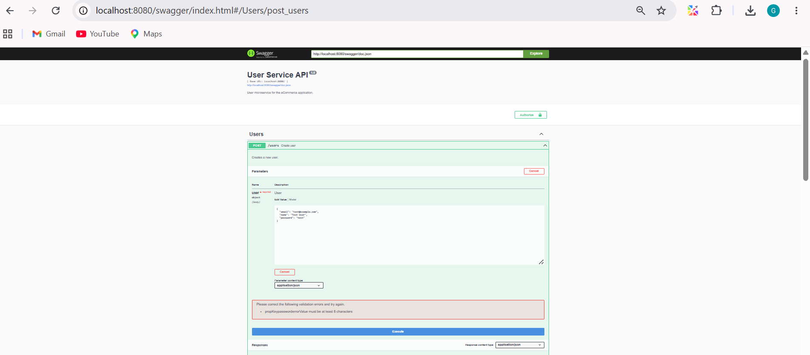

### login-response

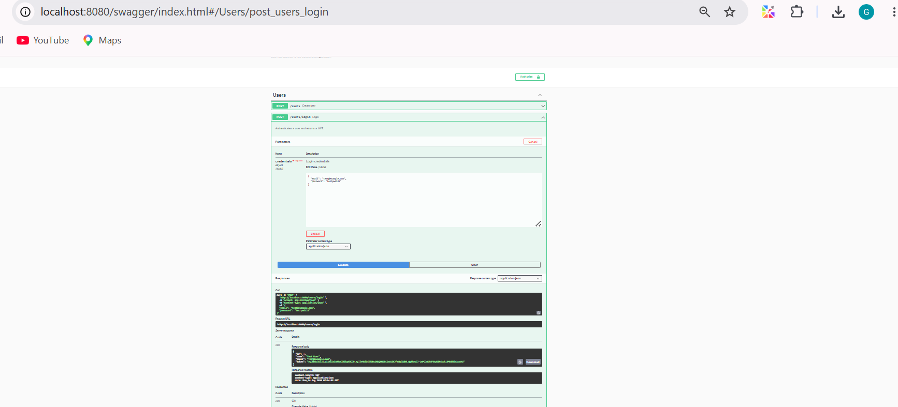

### list-products

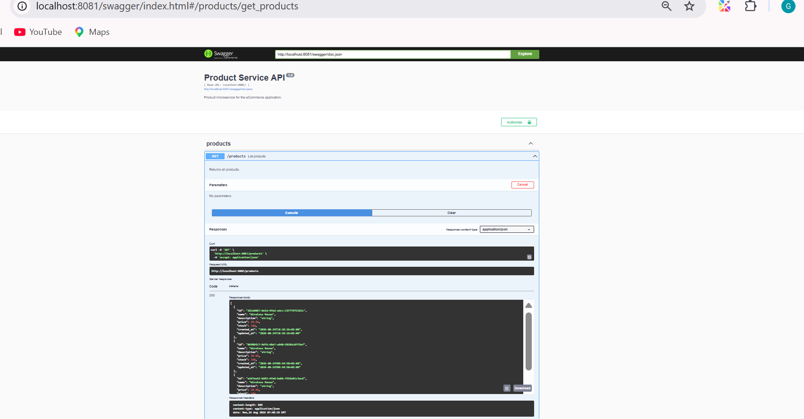

### get-product

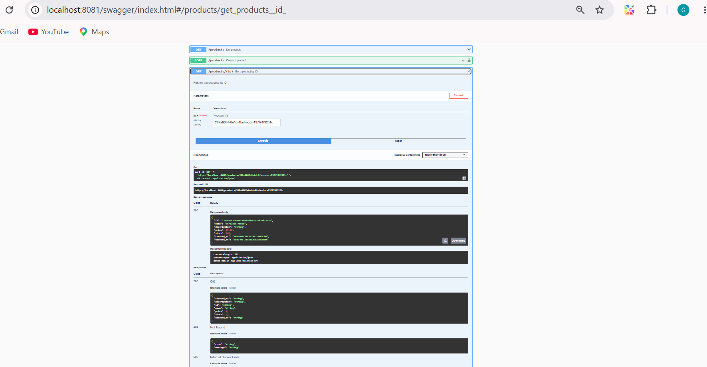

### post-product

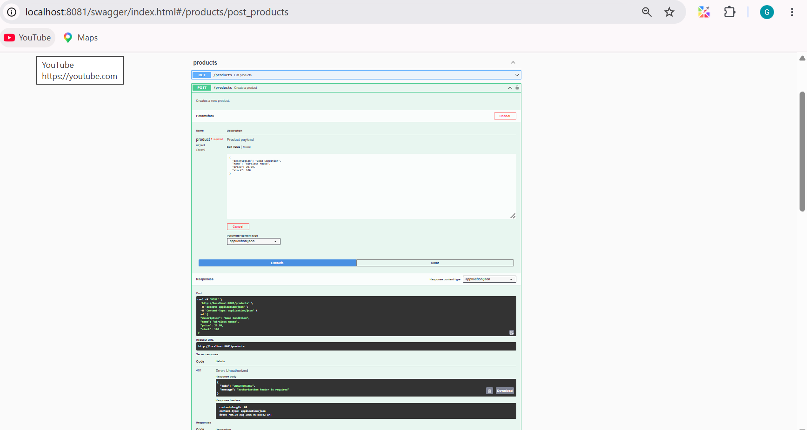

### place-order

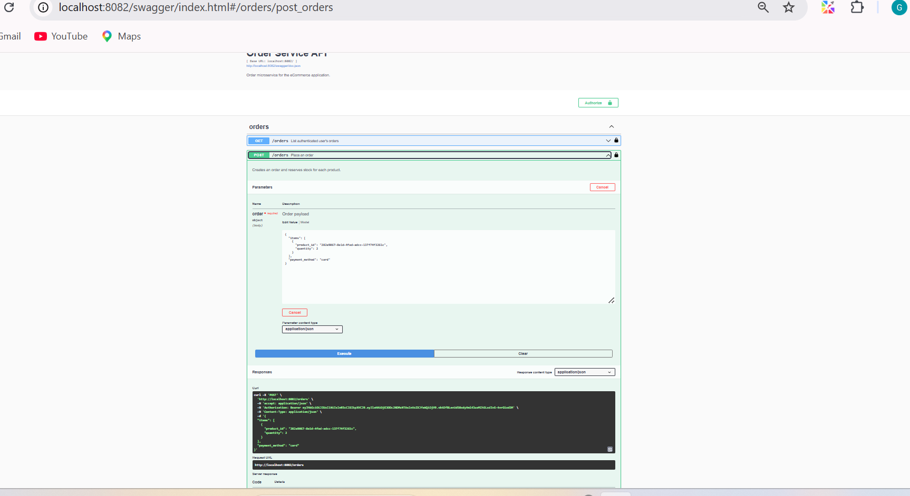

### get-order

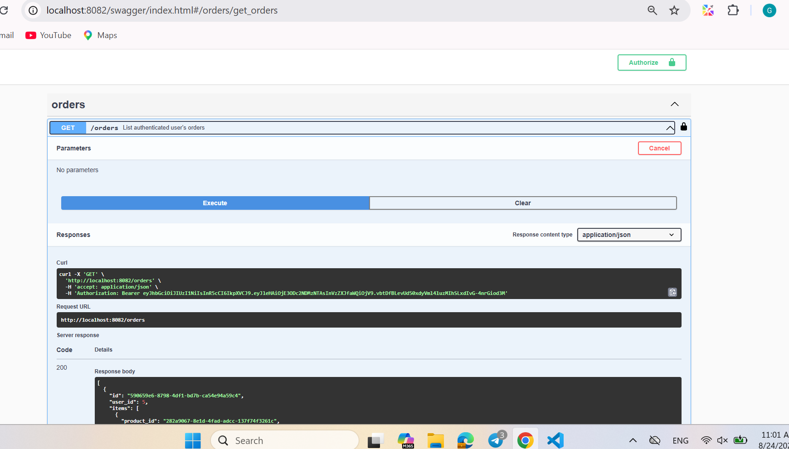

### cancel-order

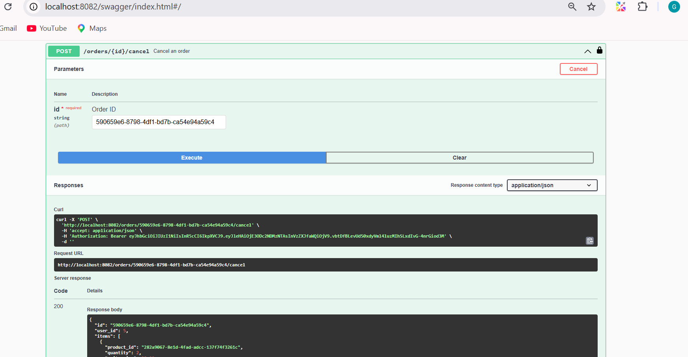

### charge-payment

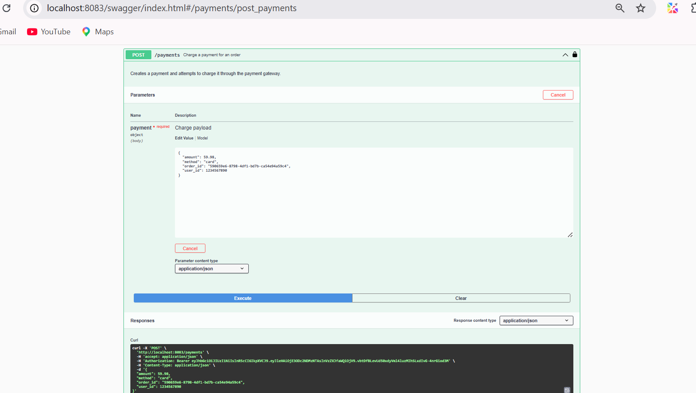

### get-payment

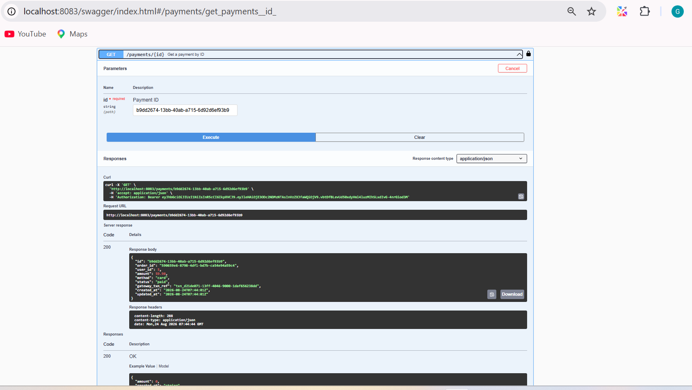

### list-payment

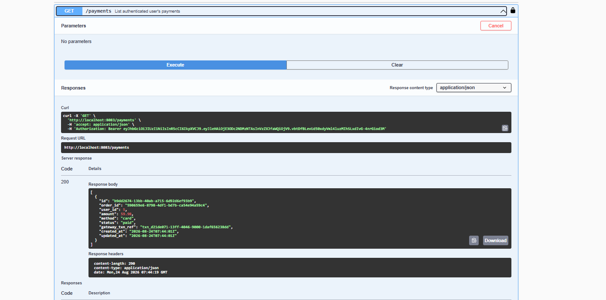

### refund-payment

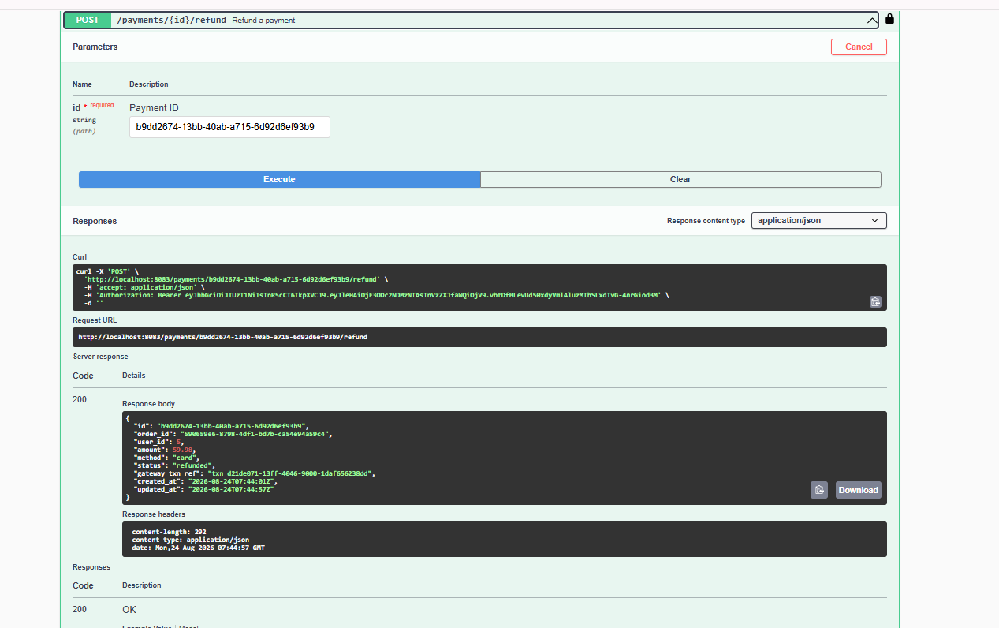

### protected-endpoint

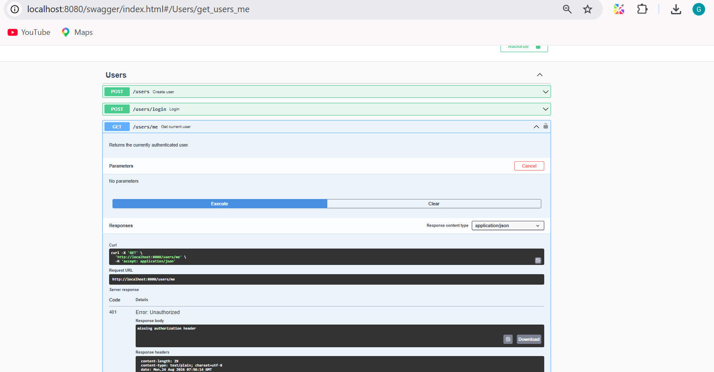

